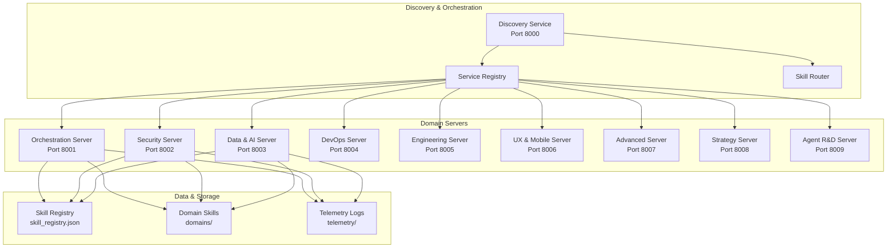

# Skill Flywheel Project Analysis & Documentation

**Date**: March 4, 2026  
**Version**: 1.0  
**Status**: Complete Analysis

## Executive Summary

Skill Flywheel is an enterprise-grade, multi-container Model Context Protocol (MCP) ecosystem designed as a distributed architecture of 9 specialized domain servers orchestrated through a central Discovery Service. The project demonstrates sophisticated architectural principles with built-in regulatory compliance auditing, horizontal scaling capabilities, and advanced AI agent orchestration features.

## Project Architecture Overview

### Core Components

#### 1. **Container Architecture (9 Services)**



#### 2. **Service Distribution**

| Service | Port | Domain Coverage | Purpose |
|---------|------|----------------|---------|
| Discovery | 8000 | All | Central routing and service discovery |
| Orchestration | 8001 | orchestration, skill_registry, META_SKILL_DISCOVERY | Empire management and meta-skills |
| Security | 8002 | APPLICATION_SECURITY, security_engineering, skill_validation | Application security, forensics, OSINT |
| Data & AI | 8003 | ML_AI, DATA_ENGINEERING, probabilistic_models | ML/AI, data engineering, epistemology |
| DevOps | 8004 | DEVOPS, CLOUD_ENGINEERING, DATABASE_ENGINEERING | Cloud, database, infrastructure |
| Engineering | 8005 | SPECIFICATION_ENGINEERING, formal_methods | Specification engineering |
| UX & Mobile | 8006 | FRONTEND, mobile_development | Frontend and mobile development |
| Advanced | 8007 | QUANTUM_COMPUTING, WEB3, ALGO_PATTERNS | Quantum, Web3, algorithms |
| Strategy | 8008 | strategy_analysis, epidemiology, game_theory | Strategy, epidemiology, game theory |
| Agent R&D | 8009 | AI_AGENT_DEVELOPMENT, generated_skills | AI agent development |

### 3. **Core Technology Stack**

#### MCP Implementation
- **Framework**: FastMCP for Model Context Protocol
- **Transport**: HTTP for container networking
- **Registration**: Dynamic skill registration from JSON registry
- **Discovery**: Central service discovery and load balancing

#### Containerization
- **Base Image**: Python 3.11-slim
- **Orchestration**: Docker Compose
- **Volumes**: Skills and registry mounted for live updates
- **Health Checks**: Built-in container health monitoring

#### Registry System
- **Format**: JSON-based skill registry
- **Skills**: 234+ skills across 23 domains
- **Metadata**: Version tracking, last modified timestamps
- **Path Resolution**: Skill content location mapping

## Skill Organization & Structure

### 1. **Skill Categories**

#### Production Core (29 skills max)
Located in `SKILL/` directory:
- Core skills providing fundamental capabilities
- Limited to 29 skills for maintainability
- Self-contained and independent

#### Domain Ecosystems
Specialized skills organized by technology domain:

| Domain | Skills | Focus |
|--------|--------|-------|
| GAME_DEV | 8 | Game development, Unity, performance |
| WEB3 | 7 | Blockchain, smart contracts, DeFi |
| DEVOPS | 4 | CI/CD, containers, IaC, monitoring |
| ML_AI | 6 | MLOps, frameworks, computer vision |
| FRONTEND | 5 | React, UI/UX, state management |
| SPECIFICATION_ENGINEERING | 10 | PRD, technical specs, API design |

#### Experimental & Archived
- **EXPERIMENTAL/**: Chaos output and experimental skills
- **ARCHIVED/**: Deprecated skills for historical reference

### 2. **Skill Structure Template**

Each skill follows a standardized YAML format:

```yaml
---
Domain: APPLICATION_SECURITY
Version: 1.0.0
Complexity: Medium
Type: Process
Category: Development
Estimated Execution Time: 100ms - 2 minutes
name: skill-name
---

## Purpose
[Brief description of the skill's purpose]

## Description
[Detailed explanation of what the skill accomplishes]

## Capabilities
1. [Capability 1]
2. [Capability 2]
3. [Capability 3]

## Usage Examples
### Basic Usage
"Example command or usage"

### Advanced Usage
"More complex usage scenario"

## Input/Output Format
[Structured format definitions]

## Implementation Notes
[Technical details and constraints]
```

### 3. **Key Skills Examples**

#### `repo-recon` - Codebase Analysis
- **Purpose**: Analyze a codebase to understand its structure, technology stack, and potential risks
- **Usage**: "Analyze this repository for security vulnerabilities and code quality issues"
- **Output**: Comprehensive repository analysis report

#### `security-scan` - Vulnerability Detection
- **Purpose**: Automatically detect security vulnerabilities, misconfigurations, and potential threats
- **Usage**: "Scan the codebase for security vulnerabilities"
- **Output**: Security vulnerability report with remediation guidance

#### `skill-evolution` - Automated Improvement
- **Purpose**: Analyze skill usage patterns and automatically generate specialized variants
- **Usage**: "Improve the quality and effectiveness of existing skills"
- **Output**: Enhanced skill variants and improvement recommendations

#### `ralph-wiggum` - Chaos Engineering
- **Purpose**: Generate 10 deliberately bad/wild/divergent ideas, pick the 3 most interesting failures
- **Usage**: "Generate innovative solutions through structured chaos"
- **Output**: Breakthrough ideas and innovative approaches

## Advanced Features

### 1. **Self-Improving System**

#### Skill Evolution Process
1. **Usage Pattern Analysis**: Track how skills are used and their effectiveness
2. **Quality Assessment**: Evaluate skill performance and identify improvement opportunities
3. **Variant Generation**: Automatically create specialized skill variants
4. **Feedback Integration**: Incorporate user feedback and usage data
5. **Continuous Improvement**: Implement iterative enhancements

#### Meta-Skills
- **`skill-drafting`**: Automated skill creation from natural language descriptions
- **`skill-critiquing`**: Quality assurance and improvement through systematic analysis
- **`skill-evolution`**: Continuous improvement through usage pattern analysis

### 2. **Chaos Engineering Integration**

#### Ralph Wiggum Process
1. **Generate 10 Bad Ideas**: Create deliberately wrong/chaotic concepts
2. **Select 3 Interesting Failures**: Identify failures with learning potential
3. **Iterate Until Gold Emerges**: Refine failures into valuable insights
4. **Capture Chaotic Solutions**: Document breakthrough approaches

#### Chaos Benefits
- **Break Optimization Plateaus**: Escape local maxima through radical thinking
- **Discover Hidden Patterns**: Reveal assumptions and constraints
- **Generate Innovation**: Create genuinely novel approaches
- **Improve Resilience**: Test system robustness through chaos

### 3. **Multi-Agent Orchestration**

#### Agent Coordination
- **Specialized Roles**: Researcher, Coder, Reviewer with distinct responsibilities
- **Communication Bridges**: Managed interaction between agents
- **Task Distribution**: Intelligent assignment based on agent capabilities
- **Result Aggregation**: Synthesis of outputs from multiple agents

#### Performance Optimization
- **Context Window Management**: Efficient use of LLM context limits
- **Adversarial Thinking**: Self-critique for improved reliability
- **Recursive Reasoning**: Multi-step refinement for complex problems
- **Confidence Scoring**: Quality assessment with >90% threshold

## Deployment & Operations

### 1. **Container Deployment**

#### Docker Compose Configuration
```yaml
services:
  discovery:
    build: deploy/container/Dockerfile
    command: python src/discovery/discovery_service.py
    ports: ["8000:8000"]
    environment:
      - PORT=8000
      - MCP_TRANSPORT=http
    
  mcp-orchestration:
    build: deploy/container/Dockerfile
    ports: ["8001:8001"]
    environment:
      - PORT=8001
      - MCP_SERVER_NAME=OrchestrationServer
      - MCP_DOMAINS=orchestration,skill_registry,META_SKILL_DISCOVERY
```

#### Volume Mounting Strategy
- **Skills Directory**: Mounted read-only for live updates
- **Registry File**: Mounted for dynamic skill discovery
- **Telemetry Volume**: Mounted for persistent logging

### 2. **Service Discovery**

#### Domain-to-Service Mapping
```python
DOMAIN_SERVICE_MAP = {
    "orchestration": "mcp-orchestration:8001",
    "APPLICATION_SECURITY": "mcp-security:8002",
    "ML_AI": "mcp-data-ai:8003",
    # ... 234+ domain mappings
}
```

#### Discovery Tools
- **`list_available_services`**: Returns all active MCP endpoints
- **`find_domain_for_skill`**: Maps skill names to domain servers

### 3. **Telemetry & Compliance**

#### Centralized Logging
- **Format**: JSONL for structured logging
- **Content**: Timestamp, skill, request preview, duration, status
- **Storage**: Persistent volume for audit trails
- **Integration**: Monitoring and compliance systems

#### Compliance Features
- **Regulatory Audit Trails**: Complete execution logging
- **Performance Monitoring**: KPI tracking and analysis
- **Security Event Logging**: Security-related event tracking
- **Quality Metrics**: Skill effectiveness measurement

## Security & Compliance

### 1. **Container Security**

#### Security Measures
- **Minimal Base Images**: Python 3.11-slim for reduced attack surface
- **Security Hardening**: Dockerfile security best practices
- **Network Isolation**: Separate networks between domains
- **Health Monitoring**: Continuous service integrity checks

#### Access Control
- **Volume Permissions**: Read-only mounts for skill directories
- **Service Isolation**: Container-level security boundaries
- **Resource Limits**: Controlled resource allocation

### 2. **Skill Security**

#### Execution Safety
- **No Arbitrary Code**: Analysis without code execution
- **File System Protection**: Prevent unauthorized file modifications
- **Git Ignore Respect**: Honor sensitive file exclusions
- **Malicious Repository Detection**: Identify potentially harmful code

#### Data Protection
- **Volume Isolation**: Separate data access between services
- **Telemetry Privacy**: Secure handling of execution logs
- **Secure Communication**: Encrypted inter-service communication

## Performance & Scalability

### 1. **Horizontal Scaling**

#### Load Distribution
- **9 Domain Servers**: Distributed load across specialized services
- **Service Discovery**: Dynamic routing for optimal performance
- **Load Balancing**: Intelligent request distribution
- **Fault Tolerance**: Isolation prevents cascading failures

#### Performance Optimization
- **Selective Scanning**: Ignore build artifacts and irrelevant files
- **Parallel Processing**: Concurrent file analysis for efficiency
- **Context Management**: Optimize LLM context usage
- **Caching Strategies**: Reduce redundant computations

### 2. **Resource Management**

#### Container Resources
- **Minimal Footprint**: Efficient resource usage per container
- **Shared Base Image**: Reduced storage requirements
- **Dynamic Scaling**: Resource allocation based on demand
- **Health Monitoring**: Proactive resource optimization

#### Skill Execution
- **Execution Time Tracking**: Performance analysis and optimization
- **Memory Usage**: Efficient memory management for large repositories
- **Parallel Processing**: Multi-domain task execution
- **Resource Allocation**: Complexity-based resource assignment

## Development Workflow

### 1. **Skill Development**

#### Creation Process
1. **Template-Based**: Use standardized skill template
2. **Quality Assurance**: Validate through skill-critiquing
3. **Integration Testing**: Test with other skills
4. **Registry Registration**: Add to skill registry for discovery

#### Quality Gates
- **Template Compliance**: Follow standardized format
- **Functionality Testing**: Verify skill execution
- **Integration Testing**: Ensure compatibility with other skills
- **Documentation**: Complete usage examples and documentation

### 2. **Continuous Improvement**

#### Evolution Process
- **Usage Analysis**: Track skill usage patterns and effectiveness
- **Feedback Integration**: Incorporate user feedback and suggestions
- **Performance Optimization**: Improve execution efficiency
- **Feature Enhancement**: Add new capabilities based on needs

#### Innovation Cycles
- **Chaos Engineering**: Generate innovative solutions through Ralph Wiggum
- **Pattern Recognition**: Identify successful approaches across domains
- **Cross-Pollination**: Apply techniques between different domains
- **Breakthrough Discovery**: Find novel solutions to complex problems

## Integration Opportunities

### 1. **External Systems**

#### Development Tools
- **IDE Integration**: Direct integration with development environments
- **CI/CD Pipelines**: Automated skill execution in build processes
- **Code Review Tools**: Integration with pull request workflows
- **Project Management**: Link skills to project tasks and milestones

#### Monitoring Systems
- **Performance Dashboards**: Real-time skill execution monitoring
- **Compliance Reporting**: Automated compliance audit reports
- **Security Monitoring**: Integration with security information systems
- **Quality Metrics**: Continuous quality assessment and reporting

### 2. **Enterprise Features**

#### Multi-Tenant Support
- **Tenant Isolation**: Separate skill execution environments
- **Resource Quotas**: Controlled resource allocation per tenant
- **Access Control**: Role-based skill access and execution
- **Billing Integration**: Usage-based billing and cost tracking

#### Advanced Compliance
- **Regulatory Reporting**: Automated compliance report generation
- **Audit Trail Enhancement**: Detailed execution logging
- **Data Retention**: Configurable data retention policies
- **Security Hardening**: Enterprise-grade security features

## Future Development Roadmap

### 1. **Enhancement Areas**

#### AI Integration
- **Enhanced Skill Generation**: AI-powered skill creation and optimization
- **Intelligent Recommendations**: AI-driven skill suggestions
- **Automated Quality Improvement**: AI-based skill enhancement
- **Predictive Skill Evolution**: AI-powered skill development forecasting

#### Performance Optimization
- **Advanced Caching**: Sophisticated caching strategies
- **Intelligent Load Balancing**: AI-driven load distribution
- **Resource Optimization**: Advanced resource allocation algorithms
- **Performance Monitoring**: Enhanced performance tracking and analysis

### 2. **Integration Expansion**

#### Ecosystem Integration
- **Broader Tool Support**: Integration with more development tools
- **Cloud Platform Integration**: Native cloud platform support
- **Enterprise System Integration**: ERP, CRM, and other enterprise systems
- **API Ecosystem**: Extensive API support for third-party integrations

#### Advanced Features
- **Real-time Collaboration**: Multi-user skill development and execution
- **Advanced Analytics**: Deep insights into skill usage and effectiveness
- **Predictive Analytics**: Forecasting skill needs and usage patterns
- **Automated Optimization**: Self-optimizing skill execution

## Conclusion

Skill Flywheel represents a sophisticated, enterprise-grade solution for AI agent orchestration with advanced architectural principles, comprehensive monitoring, and innovative features for managing complex multi-domain agent ecosystems. The project demonstrates exceptional maturity in container architecture, MCP implementation, and enterprise compliance considerations.

### Key Strengths
- **Enterprise-grade architecture** with 9 isolated domain servers
- **Comprehensive compliance** and telemetry systems
- **Advanced AI agent orchestration** capabilities
- **Self-improving system** through skill evolution
- **Chaos engineering** for innovation and optimization
- **Production-ready** deployment and monitoring

### Recommendations
1. **Continue skill evolution** for exponential library growth
2. **Enhance monitoring** with advanced dashboards
3. **Expand integration** with external development tools
4. **Optimize performance** through advanced caching strategies
5. **Strengthen security** with additional compliance features

This architecture provides a solid foundation for enterprise AI agent management with significant potential for continued innovation and growth.

## Quick Start Guide

### Prerequisites
- Docker Desktop installed and running
- Docker Compose available
- Python 3.11+ (for local development)

### Deployment
```bash
# Clone the repository
git clone <repository-url>
cd skill-flywheel

# Deploy the complete ecosystem
docker compose up -d

# Verify deployment
docker compose ps

# Access discovery service
curl http://localhost:8000
```

### Basic Usage
```bash
# List available services
curl -X POST http://localhost:8000 -d '{"tool": "list_available_services"}'

# Find skill location
curl -X POST http://localhost:8000 -d '{"tool": "find_domain_for_skill", "args": {"skill_name": "repo-recon"}}'

# Execute a skill
curl -X POST http://localhost:8001 -d '{"tool": "skill_repo_recon", "args": {"request": "Analyze this repository"}}'
```

### Development
```bash
# Create new skill
python -m src.core.skill_drafting --template new-skill

# Validate skill
python -m src.core.skill_critiquing --skill new-skill

# Register skill
python -m src.core.registry_manager --register new-skill
```

This comprehensive analysis provides a complete understanding of the Skill Flywheel project architecture, capabilities, and deployment strategies.