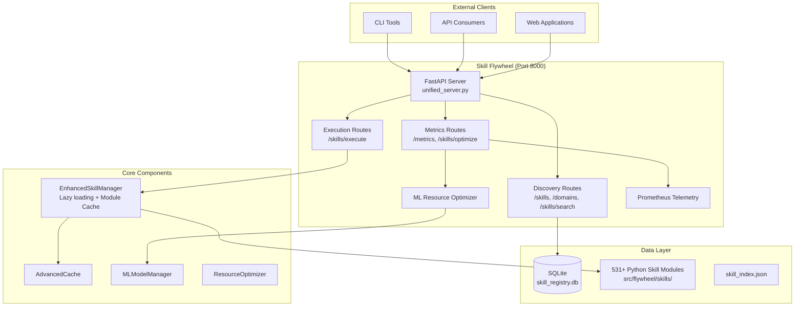
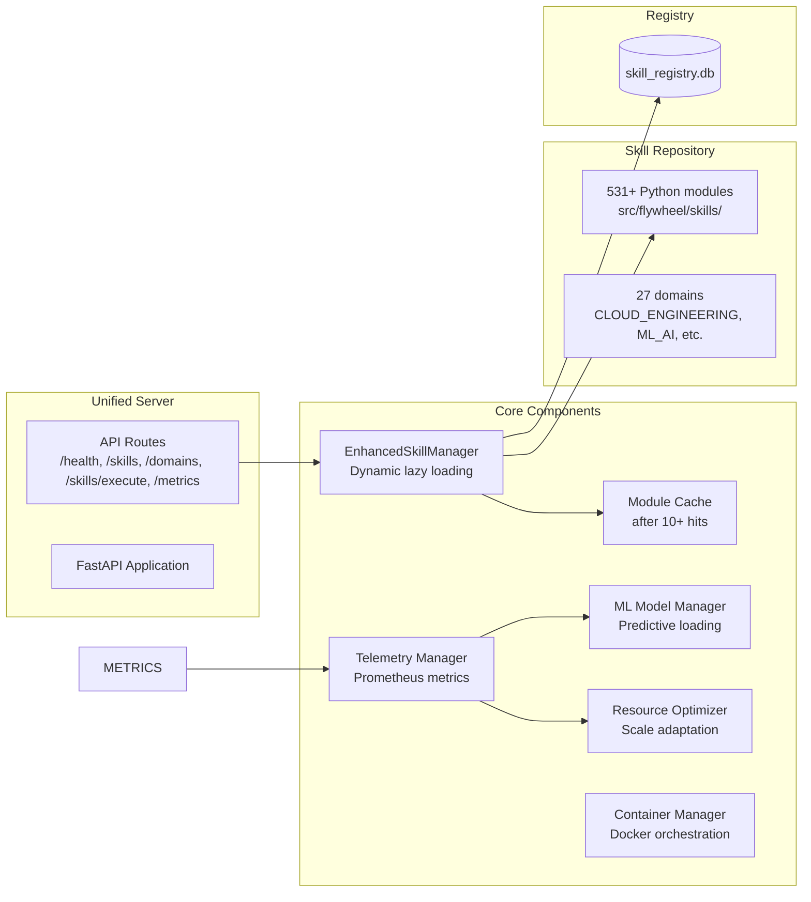

# Skill Flywheel Architecture

## System Overview

The Skill Flywheel is a **unified MCP server** — a single FastAPI application that consolidates skill discovery, execution, and ML optimization.



## Component Architecture



## Skill Module Format

Each skill is a Python module with:

```python
#!/usr/bin/env python3
"""Skill Name"""

import logging
from datetime import datetime
from typing import Any, Dict

logger = logging.getLogger(__name__)

async def invoke(payload: Dict[str, Any]) -> Dict[str, Any]:
    """MCP skill invocation."""
    action = payload.get("action", "default")
    try:
        result = ...  # business logic
        return {
            "result": result,
            "metadata": {
                "action": action,
                "timestamp": datetime.now().isoformat(),
            },
        }
    except Exception as e:
        logger.error(f"Error: {e}")
        return {
            "result": {"error": str(e)},
            "metadata": {"action": action, "timestamp": datetime.now().isoformat()},
        }

def register_skill() -> Dict[str, str]:
    """Return skill metadata."""
    return {
        "name": "skill-name",
        "description": "What this skill does",
        "version": "1.0.0",
        "domain": "DOMAIN_NAME",
    }
```

## API Endpoints

| Endpoint | Method | Description |
|----------|--------|-------------|
| `/` | GET | Health check with server info |
| `/health` | GET | Detailed health with telemetry status |
| `/skills` | GET | List all skills (with domain filter, pagination) |
| `/skills/search` | GET | Search skills by name/description |
| `/domains` | GET | List all domains and skill counts |
| `/skills/execute` | POST | Execute a skill by name |
| `/metrics` | GET | System metrics (skill performance, cache stats) |
| `/skills/optimize` | POST | Run optimization recommendations |

## Directory Structure

```
src/flywheel/
├── server/
│   └── unified_server.py       ← Main entry point (FastAPI)
├── core/
│   ├── skills.py               ← EnhancedSkillManager with lazy loading
│   ├── cache.py                ← AdvancedCache (LRU, module caching)
│   ├── telemetry.py            ← Prometheus metrics
│   ├── ml_models.py            ← ML predictions for skill loading
│   ├── resource_optimizer.py   ← Resource adaptive scaling
│   └── containers.py           ← Docker container management
├── skills/                     ← 531+ skill modules
│   ├── CLOUD_ENGINEERING/
│   ├── ML_AI/
│   ├── DATA_ENGINEERING/
│   ├── TESTING_QUALITY/
│   ├── modern_backend/         ← Skills from claw-code analysis
│   └── ...                     ← 27 domains total
└── ...

data/
├── skill_registry.db           ← SQLite registry (DO NOT edit schema)
├── skills_backlog.json         ← Backlog tracking

scripts/
├── scaffold_skill.py           ← Generate new skills from CLI args or SKILL.md
├── validate_skill.py           ← Validate skill format compliance
└── ...
```

## Current State (2026-04-01)

| Metric | Value |
|--------|-------|
| Total Skills | 531+ |
| Domains | 27 |
| Format Compliant | 501/531 (94%) |
| Tests | 30 pytest tests, all passing |
| Server Type | Unified FastAPI (single port) |
| Database | SQLite (skill_registry.db) |

## Scaffolding New Skills

```bash
# From command line
python scripts/scaffold_skill.py my_skill DOMAIN --description "Does X" --actions "process:Do X" "analyze:Do Y"

# From SKILL.md spec
python scripts/scaffold_skill.py --from-spec domains/ML_AI/SKILL.tutorial/SKILL.md

# Validate
python scripts/validate_skill.py src/flywheel/skills --recursive
```

## Pipeline: Spec → Code → Test

1. **Spec** (`domains/`) — SKILL.md defines requirements
2. **Scaffold** (`scripts/scaffold_skill.py`) — Generates Python module
3. **Validate** (`scripts/validate_skill.py`) — Checks format compliance
4. **Implement** — Developer fills in business logic
5. **Test** — pytest tests verify behavior
6. **Register** — Skill added to skill_registry.db