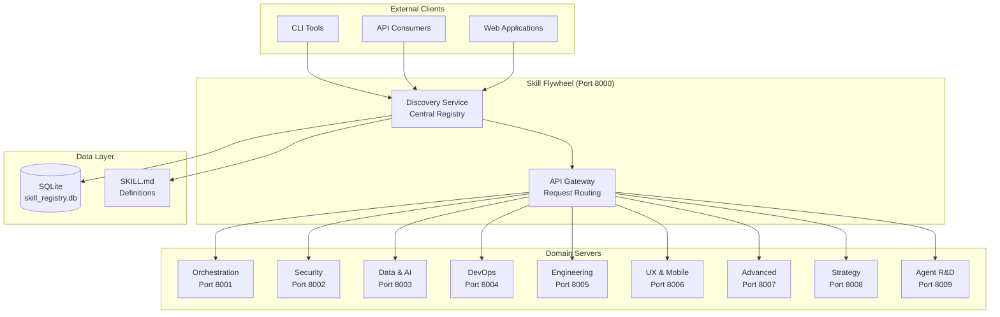
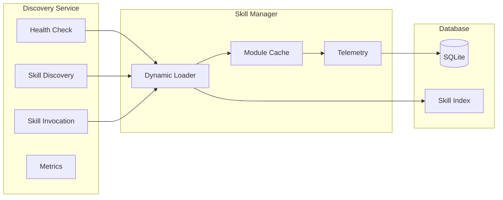
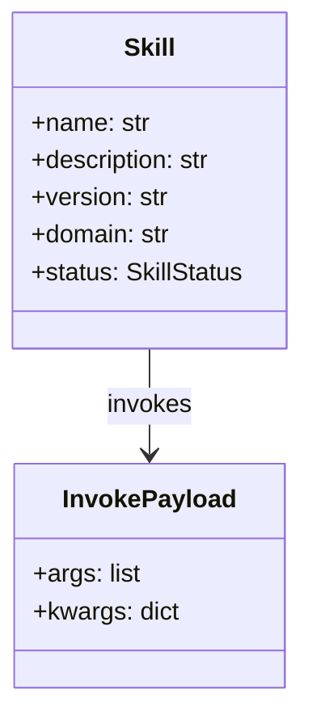
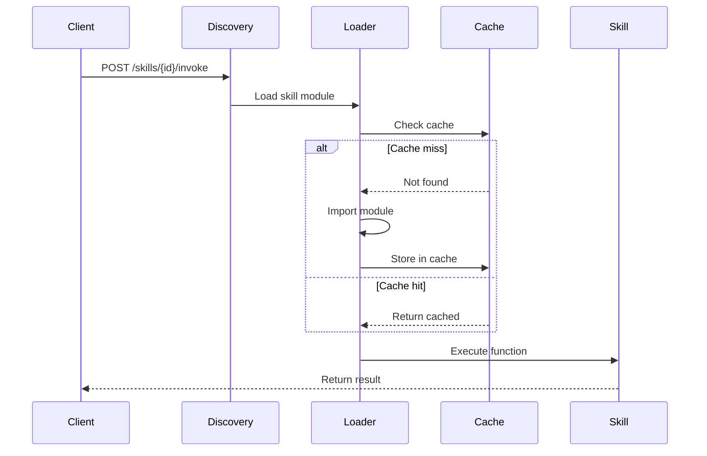

# Skill Flywheel Architecture

## System Overview



## Component Architecture



## Skill Structure



## Data Flow



## Technology Stack

| Component | Technology |
|-----------|------------|
| API Server | FastAPI + Uvicorn |
| Database | SQLite |
| Container | Docker |
| Orchestration | Docker Compose |
| Monitoring | Prometheus |
| ML Models | scikit-learn, PyTorch |

## Directory Structure

```
skill-flywheel/
├── src/
│   ├── core/           # Shared core components
│   │   ├── skills.py
│   │   ├── telemetry.py
│   │   ├── cache.py
│   │   └── ...
│   ├── server/        # API servers
│   │   ├── discovery_service.py
│   │   └── enhanced_mcp_server_v3.py
│   └── skills/        # Skill implementations
│       ├── clustering/
│       ├── game_theory/
│       ├── epistemology/
│       └── ...
├── domains/           # SKILL.md definitions
├── data/             # Database & models
├── tests/            # Test suite
└── .github/         # CI/CD workflows
```
