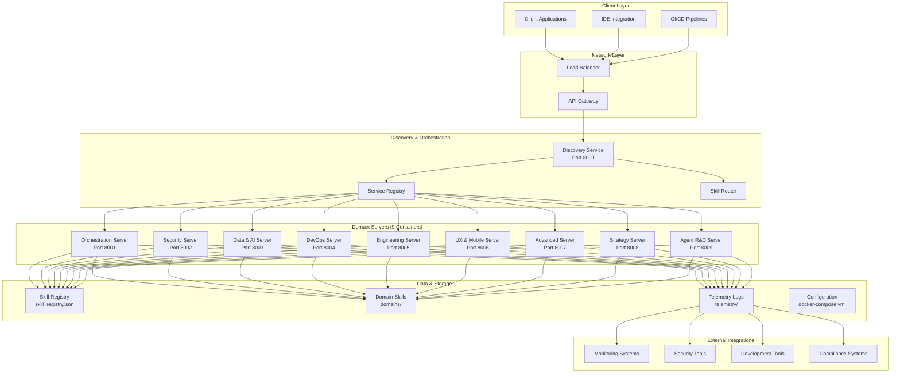
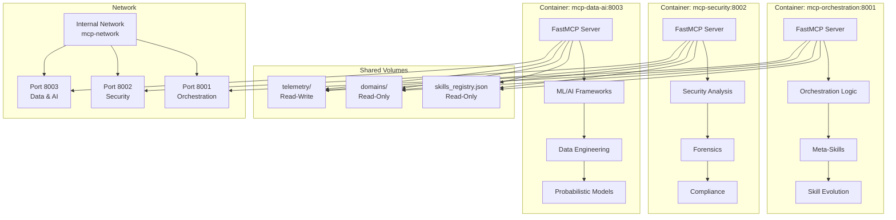
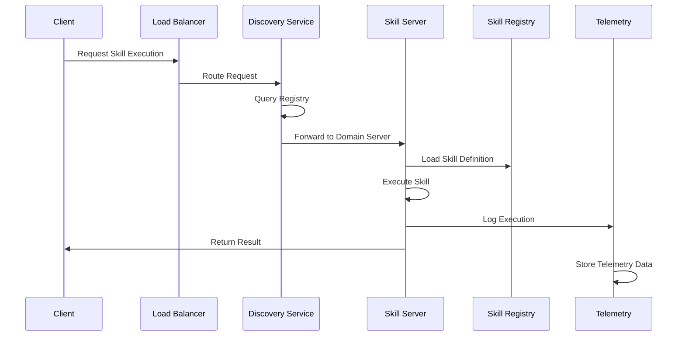
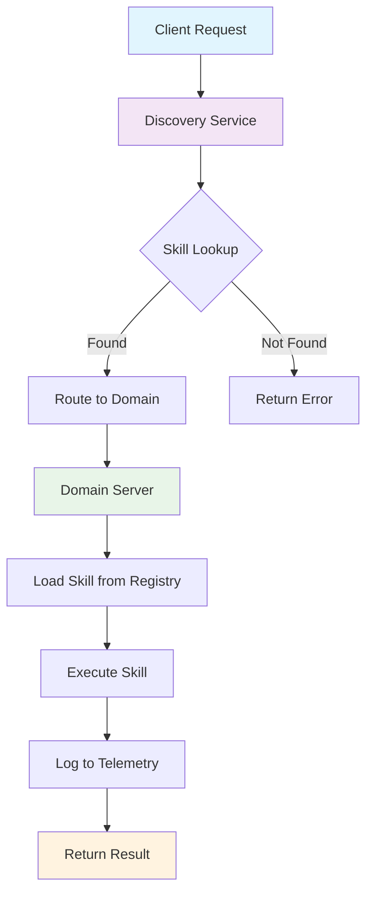
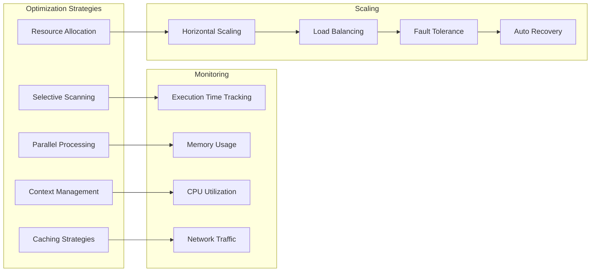
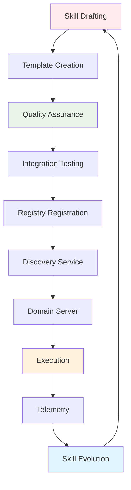
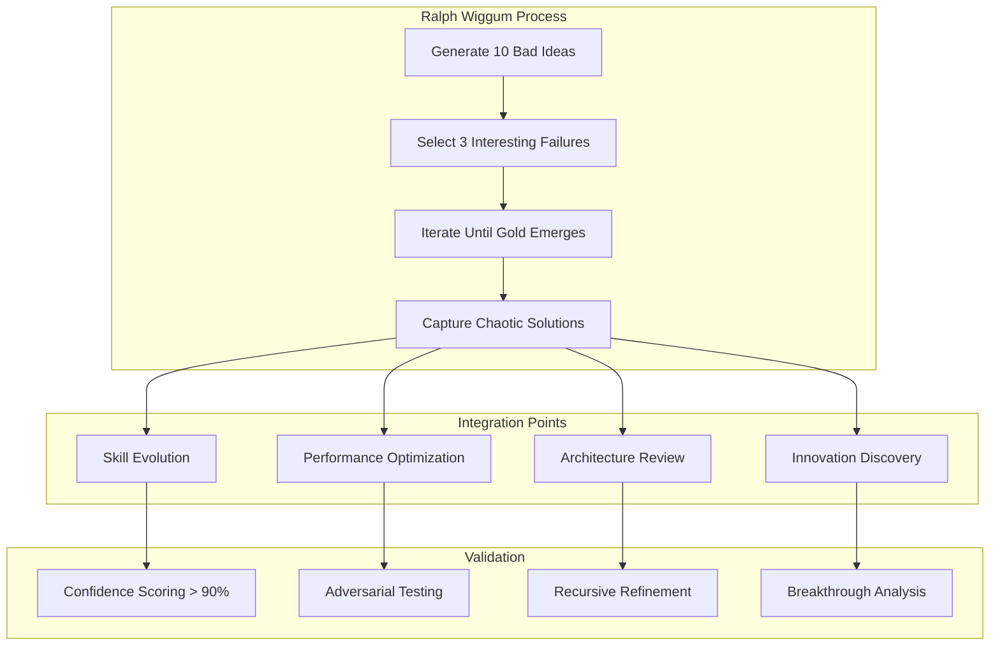

# Skill Flywheel Architecture Diagram

## High-Level System Architecture



## Container Architecture Details



## Skill Registry Architecture

```mermaid
graph LR
    subgraph "Registry Structure"
        A[skill_registry.json]
        B[234+ Skills]
        C[23 Domains]
        D[Version Tracking]
        E[Last Modified]
    end
    
    subgraph "Domain Organization"
        F[SKILL/ - Core (29 max)]
        G[DOMAIN/ - Specialized]
        H[EXPERIMENTAL/ - Chaos]
        I[ARCHIVED/ - Deprecated]
    end
    
    subgraph "Skill Metadata"
        J[Name]
        K[Domain]
        L[Version]
        M[Purpose]
        N[Description]
        O[Path]
    end
    
    A --> B
    B --> C
    C --> D
    D --> E
    
    A --> F
    A --> G
    A --> H
    A --> I
    
    B --> J
    B --> K
    B --> L
    B --> M
    B --> N
    B --> O
```

## Data Flow Architecture



## MCP Protocol Flow



## Security Architecture

```mermaid
graph TB
    subgraph "Security Layers"
        A[Network Isolation]
        B[Container Security]
        C[Skill Validation]
        D[Execution Sandboxing]
        E[Audit Logging]
    end
    
    subgraph "Threat Protection"
        F[Malicious Code Detection]
        G[File System Protection]
        H[Resource Limits]
        I[Access Control]
    end
    
    subgraph "Compliance"
        J[Regulatory Auditing]
        K[Data Protection]
        L[Execution Tracking]
        M[Performance Monitoring]
    end
    
    A --> B
    B --> C
    C --> D
    D --> E
    
    F --> G
    G --> H
    H --> I
    
    J --> K
    K --> L
    L --> M
```



## Performance Architecture



## Development Workflow



## Chaos Engineering Integration



## Key Architecture Principles

### 1. **Container Isolation**
- Each domain runs in its own container
- Network isolation for security
- Independent scaling and deployment

### 2. **Service Discovery**
- Central registry for skill routing
- Dynamic service location
- Load balancing across domains

### 3. **Compliance & Telemetry**
- Complete execution logging
- Regulatory audit trails
- Performance monitoring

### 4. **Self-Improvement**
- Automated skill evolution
- Usage pattern analysis
- Quality improvement loops

### 5. **Chaos Engineering**
- Ralph Wiggum integration
- Innovation through chaos
- Optimization plateau breaking

### 6. **Multi-Agent Orchestration**
- Specialized agent roles
- Communication bridge management
- Task distribution and coordination